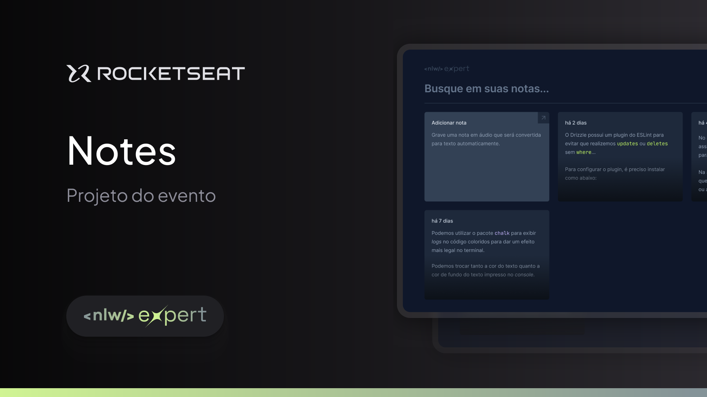

# Notexpert 

&nbsp;&nbsp;&nbsp;&nbsp;*"A notes app powered by SpeechRecognition&trade;"*

&nbsp;&nbsp;&nbsp;&nbsp;*"The next generation of note apps. Write (or speak out loud) your notes easily, anytime, anywhere.."*

Take a look at the working version [here](https://notexpert.vercel.app).

## Use Cases

- [x] Notes can be taken manually or by recording
- [x] Notes can be persisted locally
- [ ] Notes can be persisted in a database
- [x] Persisted notes can be retrieved
- [x] Notes can be deleted
- [ ] Notes can be updated
- [x] PWA support for better user experience
- [ ] Users can authenticate
- [x] Responsive
- [x] Deploy

Layout by [Rocketseat](https://www.rocketseat.com.br)&trade;
